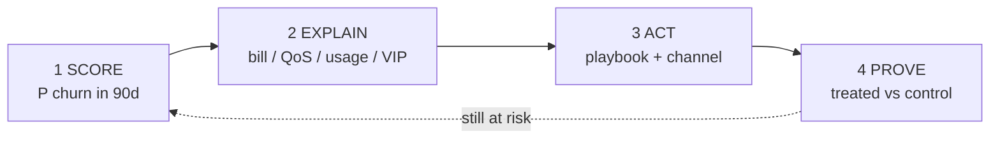
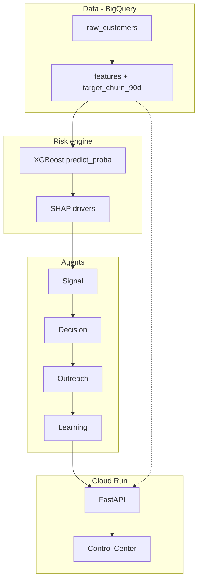

# Telco 6G Churn Loop

### Stop migration churn before it shows up in next quarter’s revenue.

When a carrier pushes subscribers from 5G → 6G, the upgrade story looks great on a slide. On the ground it’s messier: bill shock, QoS dips, usage drop-offs, angry support tickets — and the customers most likely to leave are often the **highest ARPU migrants**.

This project is an end-to-end **churn control center**: predict who will leave in the next 90 days, explain *why*, pick the right intervention, measure uplift.

Not a notebook demo. A runnable system — model → agents → API → executive UI → live on Cloud Run.

---

## Live demos

| Surface | URL |
|---|---|
| **Control center (UI)** | https://telco-6g-churn-ui-454334461204.us-central1.run.app |
| **API** | https://telco-6g-churn-loop-454334461204.us-central1.run.app |
| **API docs** | https://telco-6g-churn-loop-454334461204.us-central1.run.app/docs |
| **Source** | https://github.com/rasikakulkarni910/telco-6g-churn-loop |

Open the UI → pick **CEO / CFO / CPO** → **Run loop** → read headline KPIs, trends, and exceptions on one screen (no explorer clutter).

---

## The problem (C-level framing)

Network migrations create a **retention cliff**:

1. High-value users migrate first.
2. Post-cutover friction shows up as QoS issues, bill changes, or “this isn’t worth it” usage decline.
3. Classic churn models say “at risk” too late — or without a playbook.
4. CRM teams spray the same offer at everyone and can’t prove lift.

**What leadership actually needs**

- A **probability**, not a red/yellow/green badge: `P(churn in next 90 days)`
- **Drivers** they can act on (network vs billing vs value vs VIP)
- A closed loop: detect → decide → intervene → learn
- An experiment, not folklore: treated vs control uplift by playbook

That’s the product.

---

## What this system does

1. **Scores** every subscriber with XGBoost → `risk ∈ [0, 1]` = P(churn within ~90 days).
2. **Explains** each score with tree-path SHAP drivers, mapped to categories: network · billing · usage · support · migration.
3. **Enters** only 6G migrants above a risk threshold with at least one strong driver.
4. **Routes** them into a playbook + intensity (digital vs outbound).
5. **Generates** intervention copy (deterministic templates; LLM-ready stub).
6. **Learns** via treated/control assignment and simulated outcomes → uplift by segment × playbook.
7. **Exposes** the loop over FastAPI and a Streamlit control tower for execs and PMs.

---

## System architecture

**Predict who leaves. Fix why. Prove it worked.**

```text
   SCORE  →  EXPLAIN  →  ACT  →  PROVE
     ↑                              │
     └──────── still at risk ───────┘
```



| | Question answered | Output |
|---|---|---|
| **Score** | Who leaves in 90 days? | Risk probability (not a traffic-light badge) |
| **Explain** | Why — bill, network, usage, VIP? | SHAP drivers → category |
| **Act** | What do we do? | Playbook + digital/outbound |
| **Prove** | Did it beat control? | Uplift by segment × playbook |

Exit when `churned` or `stabilized`. Enter only 6G migrants with risk ≥ 0.60 and a strong driver.

```text
BigQuery features  →  XGBoost + SHAP  →  Signal → Decision → Outreach → Learning  →  FastAPI + Streamlit (Cloud Run)
```

<details>
<summary>Stack detail (optional)</summary>



**Signal entry (all required):** `migration_flag = 1` · `risk ≥ 0.60` · ≥1 strong driver (`|SHAP| ≥ 0.25`)

</details>

**Loop exit conditions**

| Status | What happens |
|---|---|
| `churned` | Do not re-enter |
| `stabilized` | Do not re-enter (successful rescue) |
| `active` + entry rules fail | Skipped this cycle |
---

## Driver → playbook map

| Top driver category | Playbook | When intensity goes outbound |
|---|---|---|
| **network** | Network Rescue | High value × high risk |
| **billing** | Bill Clarity + Price Protection | High value × high risk |
| **usage** | 6G Value Unlock | Extreme risk bands |
| **support** / **migration** | VIP Rescue (esp. High ARPU) | Default for High value VIPs |

This is the operating system for retention after a network cutover — not “send everyone 10% off.”

---

## How we define the 90-day probability

The public Telco CSV is **survival data** (`tenure` + eventual `Churn`), not a timed label. We don’t pretend renaming `Churn` is a 90-day forecast.

We **construct** a landmark label:

```text
At score time t = tenure_at_score:
  target_churn_90d = 1  if churn occurs within the next ~90 days (3 months)
  target_churn_90d = 0  if observed event-free through that window
```

- Eventual churners scored *early* can correctly be label `0`.
- Features are as-of the landmark (no lifetime `TotalCharges` leakage).
- Model output: `risk = predict_proba` → **P(churn in next 90 days | state at score time)**.

Honest demo note: migration stressors are synthetic and correlated with the horizon label so SHAP and playbooks have signal. Swap in real post-migration telemetry for production.

---

## Experimental design

Inside each `(segment, playbook)` stratum:

| Arm | Treatment | Outcome |
|---|---|---|
| **Treated** | Intervention applied | Lower simulated churn; usage lift by playbook |
| **Control** | No intervention effect | Baseline churn ≈ risk |

Uplift reported as:

- **Churn reduction** = control churn − treated churn  
- **Usage uplift** = treated usage change − control usage change  

v1 outcomes are simulated from risk + playbook priors — the plumbing is production-shaped; plug in real CRM/network outcomes next.

---

## Tech stack

| Layer | Choice |
|---|---|
| Data | BigQuery (`raw_customers` → `features`) |
| Model | XGBoost + SHAP-style `pred_contribs` |
| Agents | Pure Python (Signal → Decision → Outreach → Learning) |
| API | FastAPI on Cloud Run |
| UI | Streamlit control center on Cloud Run |
| Build | Cloud Build from source (no local Docker required) |

---

## Repo overview

It looks like a lot of files. Mentally it’s **four layers + deploy glue**:

```text
BigQuery data  →  Model (risk + drivers)  →  Agents (loop)  →  App (API + UI)
```

| Folder | Job | Files that matter |
|---|---|---|
| `data/` | Land raw Telco data in BQ + build landmark `features` | `download_*.py`, `load_raw_to_bigquery.py`, `features_builder.py` |
| `models/` | Train XGBoost + serve `risk` / SHAP drivers | `train_churn_model.py`, `churn_model_service.py`, `churn_model.json` |
| `agents/` | Signal → Decision → Outreach → Learning | one module per agent + `run_loop_demo.py` |
| `app/` | Product surfaces | `api.py` (FastAPI), `ui.py` (Streamlit) |
| root | Ship it | `main.py`, `Dockerfile*`, `requirements*.txt`, `README.md` |

Everything else is support: configs (`.gitignore`, env examples), model artifacts (`metrics.json`, SHAP summary), one notebook, Cloud Build for the UI. Not a separate product — just what you need to train, explain, loop, and deploy.

```text
telco_6g_churn_loop/
├── data/           # BQ ingest + features
├── models/         # XGBoost risk engine
├── agents/         # churn intervention loop
├── app/            # FastAPI + Streamlit
├── notebooks/      # optional EDA
└── main.py         # Cloud Run entry
```

---

## Run locally

```bash
python3 -m venv .venv && source .venv/bin/activate
pip install -r requirements.txt

export PROJECT_ID=your-gcp-project
gcloud auth application-default login

python data/download_telco_dataset.py
python data/load_raw_to_bigquery.py
python data/features_builder.py
python models/train_churn_model.py

# API
uvicorn app.api:app --reload --port 8080

# UI (second terminal)
export API_BASE_URL=http://127.0.0.1:8080
streamlit run app/ui.py
```

One-shot agent demo (no UI):

```bash
python agents/run_loop_demo.py --limit 400
```

---

## Deploy (Cloud Run, from source)

**API**

```bash
export PROJECT_ID=your-gcp-project

gcloud run deploy telco-6g-churn-loop \
  --source . \
  --region=us-central1 \
  --allow-unauthenticated \
  --memory=2Gi \
  --set-env-vars=PROJECT_ID=$PROJECT_ID,BIGQUERY_DATASET=telco_churn,BIGQUERY_TABLE=features
```

**UI** (points at the API URL)

```bash
gcloud builds submit --config=cloudbuild-ui.yaml
gcloud run deploy telco-6g-churn-ui \
  --image=us-central1-docker.pkg.dev/$PROJECT_ID/cloud-run-source-deploy/telco-6g-churn-ui:latest \
  --region=us-central1 \
  --allow-unauthenticated \
  --set-env-vars=API_BASE_URL=https://YOUR-API-URL
```

| Variable | Purpose |
|---|---|
| `PROJECT_ID` | GCP project |
| `BIGQUERY_DATASET` | default `telco_churn` |
| `BIGQUERY_TABLE` | default `features` |
| `API_BASE_URL` | Streamlit → FastAPI |

---

## Why this is portfolio-grade

Most churn projects stop at a ROC curve.

This one answers the questions a VP of Consumer actually asks:

- Who is about to leave **in the next 90 days**?
- **Why** — network, bill, usage, or VIP support?
- What do we **do** about it?
- Did the playbook **beat control**?

That’s the difference between a model and a **retention product**.
